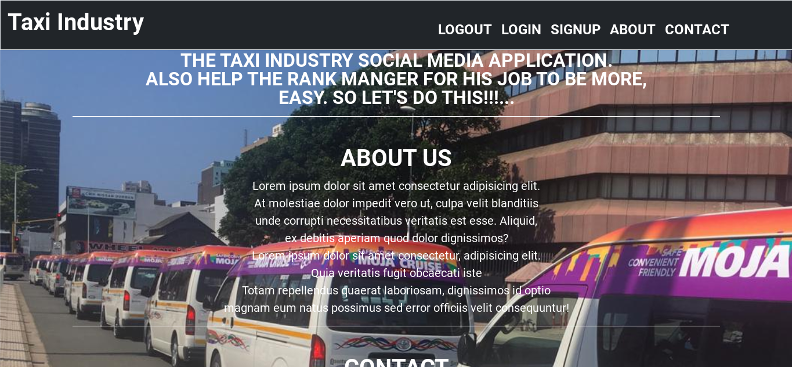

# Taxi Industry Socila Media.

This the Taxi Social media application, it's will help the drivers to connect more easily, But it will help taxi Rank Mananger the most, he will be able to collect the drivers information easy from the database without writing each drivers information in the book.


## Table of contents

- [Overview](#overview)
  - [Links](#links)
- [My process](#my-process)
  - [Built with](#built-with)
  - [What I learned](#what-i-learned)
  - [Continued development](#continued-development)
  - [Useful resources](#useful-resources)
- [Author](#author)
- [Acknowledgments](#acknowledgments)

## Overview

### Links

- Code URL: [code](https://github.com/Ziphozenkosimthombe/Taxi_Industry.git)
- Live Site URL: [taxi-industry](taxi-industry.me)

## My process

### Built with

- [EJS](https://ejs.co/) - templete engine
- CSS
- [Bootstrap](https://getbootstrap.com/) - CSS framework
- [node.js](https://nodejs.org/) - Node.js is a JavaScript runtime built on Chrome's V8 JavaScript engine.

- [express.js](https://expressjs.com/) - Node.js web application framework.
- [Cloudinary](https://cloudinary.com/) - store the images and it as a URL.
- [Passport.js](https://www.passportjs.org/) - authentication middleware for Node.js.
- [MongoDb](https://www.mongodb.com/) - an open source NoSQL database management program.
- [Nodemailer](https://nodemailer.com/) - Nodejs application module.
- [Bcrypt](https://bcrypt-generator.com/) - A library to help with hash passwords.

### What I learned

These was my first biggest full stack application i use to build small full stack application so there so much things that i have learn while i was building the project.I have learn how to use Authentication in node.js using the passport.js so i decided to use passport-local because it much more easy to understand and it straight foward.

```js
exports.postSignup = async (req, res, next) => {
  try {
    // Upload image to cloudinary
    const result = await cloudinary.uploader.upload(req.file.path);
    const validationErrors = [];
    if (!validator.isEmail(req.body.email))
      validationErrors.push({ msg: "Please enter a valid email address." });
    if (!validator.isLength(req.body.password, { min: 8 }))
      validationErrors.push({
        msg: "Password must be at least 8 characters long",
      });
    if (req.body.password !== req.body.confirmPassword)
      validationErrors.push({ msg: "Passwords do not match" });

    if (validationErrors.length) {
      req.flash("errors", validationErrors);
      return res.redirect("../signup");
    }
    req.body.email = validator.normalizeEmail(req.body.email, {
      gmail_remove_dots: false,
    });

    const existingUser = await User.findOne({
      $or: [{ email: req.body.email }, { userName: req.body.userName }],
    });

    if (existingUser) {
      req.flash("errors", {
        msg: "Account with that email address or username already exists.",
      });
      return res.redirect("../signup");
    }

    const user = new User({
      userName: req.body.userName,
      email: req.body.email,
      numberPlate: req.body.numberPlate,
      image: result.secure_url,
      cloudinaryId: result.public_id,
      role: req.body.role,
      complete: false,
      password: req.body.password,
    });
    const itemsLeft = await User.countDocuments({ complete: false });

    await user.save();

    req.logIn(user, (err) => {
      if (err) {
        return next(err);
      }
      res.redirect("/feed");
    });
  } catch (err) {
    return next(err);
  }
};
```

On my front-end side i did't write the javascript i only have css so what i learn is this amazing module call 'method-override' it just allows me to use HTTP verbs such as PUT or DELETE in places where the client doesn't support it, so method-override it just make my life and my work more easy.

```html
<form
  class="col-1"
  action="/post/likePost/<%= post._id %>?_method=PUT"
  method="POST">
  <button class="btn btn-primary fa fa-heart heart__btn" type="submit"></button>
</form>
```

I have also learn how to use the 'Bcrypt' libary that make hash passwork on my database side, so that i can not be able to see the users password.

```js
UserSchema.pre("save", function save(next) {
  const user = this;
  if (!user.isModified("password")) {
    return next();
  }
  bcrypt.genSalt(10, (err, salt) => {
    if (err) {
      return next(err);
    }
    bcrypt.hash(user.password, salt, (err, hash) => {
      if (err) {
        return next(err);
      }
      user.password = hash;
      next();
    });
  });
});
```

I also have try to take the chance implementing the nodemailer on my project and i found that very intresting and it was more easy to learn it and emplement it on my project and it work very well.

Another thing that i learn is to use bootstrap CSS framework for making the responsive website i was thinking i will found it more hard but when i start to implement it was very easy to learn and i found it be my best CSS Framewrok that i can use for my projects and make me not writing the many lines and CSS code, and save me more much time.

### Continued development

Use this section to outline areas that you want to continue focusing on in future projects. These could be concepts you're still not completely comfortable with or techniques you found useful that you want to refine and perfect.

**Note: Delete this note and the content within this section and replace with your own plans for continued development.**

### Useful resources

- [Example resource 1](https://www.example.com) - This helped me for XYZ reason. I really liked this pattern and will use it going forward.
- [Example resource 2](https://www.example.com) - This is an amazing article which helped me finally understand XYZ. I'd recommend it to anyone still learning this concept.

**Note: Delete this note and replace the list above with resources that helped you during the challenge. These could come in handy for anyone viewing your solution or for yourself when you look back on this project in the future.**

## Author

- Website - [Add your name here](https://www.your-site.com)
- Frontend Mentor - [@yourusername](https://www.frontendmentor.io/profile/yourusername)
- Twitter - [@yourusername](https://www.twitter.com/yourusername)

**Note: Delete this note and add/remove/edit lines above based on what links you'd like to share.**

## Acknowledgments

This is where you can give a hat tip to anyone who helped you out on this project. Perhaps you worked in a team or got some inspiration from someone else's solution. This is the perfect place to give them some credit.

**Note: Delete this note and edit this section's c

https://github.com/Ziphozenkosimthombe/Taxi_Industry/assets/123859903/478610e8-ba0c-4a7a-b0db-b49e0f630d67


